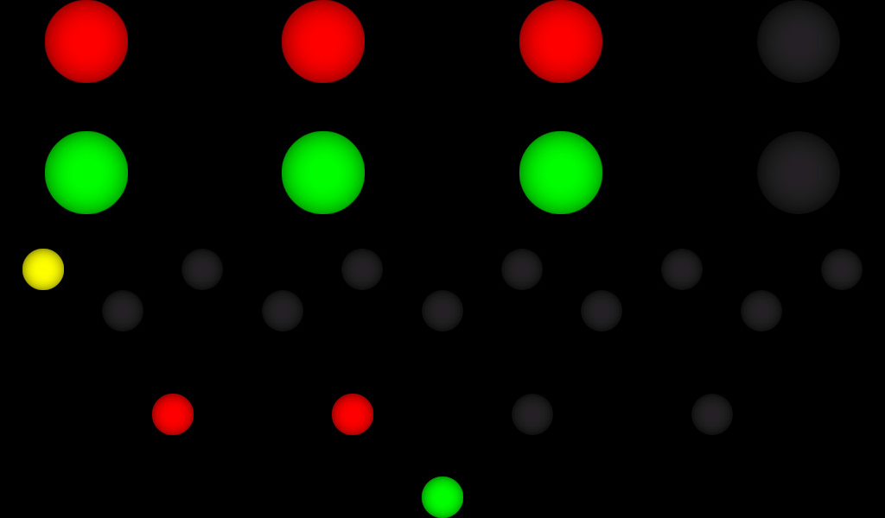

c2kr (clock 2000 - in rust!)
============================

This is a rewrite in rust of the [c2k](https://github.com/x1125/c2k) I've built six years ago.
The program moved from a Raspberry Pi 2B to a Raspberry Pi Zero W and was way to heavy, so it had to lose some overhead and become more efficient.

The assets are compiled into the binary, which increases the memory usage significantly, but can easily be changed.

A simple `cargo run` should build that thing.
On a Debian Bookworm based machine, the following packages were required:
* gcc
* libsdl2-dev
* libsdl2-image-dev
